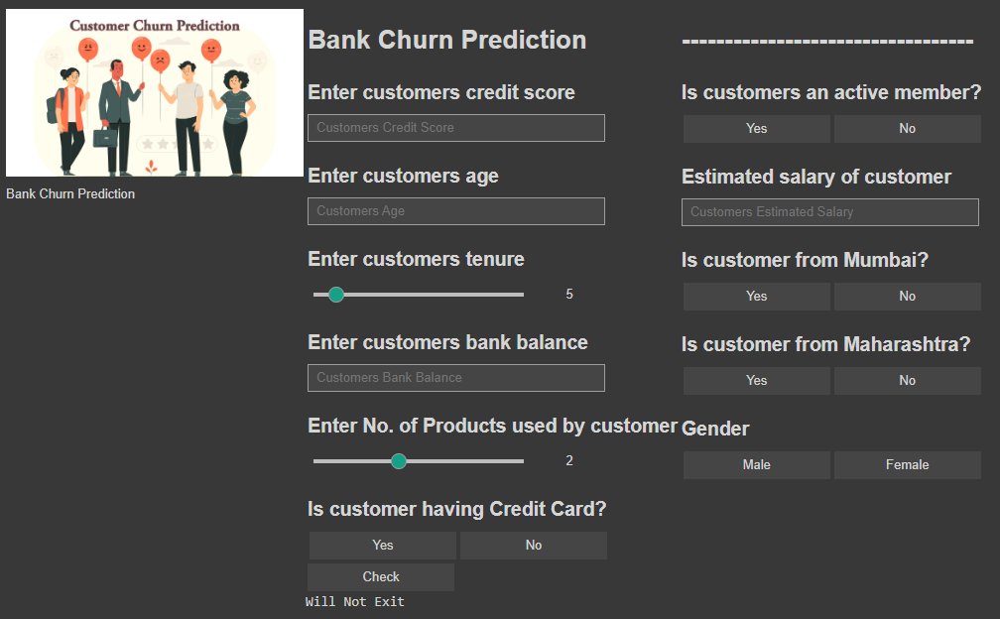

# Bank Churn Prediction System

## Project Overview
This project aims to predict whether a bank customer will exit or stay based on various factors. It utilizes machine learning techniques to analyze customer data and provide insights into customer churn.

## Preview Image
[]

---

## Table of Contents

- [Project Overview](#project-overview)
- [Features](#features)
- [Setup](#setup)
  - [Prerequisites](#prerequisites)
  - [Running the System](#running-the-system)
- [Usage](#usage)
- [Contribution](#contribution)

---

## Features
- Accurate customer churn prediction.
- User-friendly input interface.
- Machine learning model with high accuracy.
- Data visualization for insights.
- Customizable parameters for prediction.

## Setup

### Prerequisites
Before running the system, ensure you have the following installed:
- Jupyter Notebook
- Python 3.x
- Required Python libraries (scikit-learn, pandas, numpy, matplotlib, ipywidgets)

### Running the System
1. Clone this repository to your local machine:
   ```shell
   git clone https://github.com/prathmeshborate/Bank-Churn-Prediction.git
   ```

2. Open Jupyter Notebook:
   ```shell
   jupyter notebook
   ```

3. Navigate to the project folder and open the `Untitled1.ipynb` notebook.

4. Follow the instructions in the notebook to run the Bank Churn Prediction system.

## Usage
1. Launch the Jupyter Notebook and open the project's notebook.
2. Use the provided user-friendly input interface to enter customer data.
3. Click the "Predict" button to obtain the churn prediction result.
4. Review the prediction and insights generated by the system.

## Contribution
Contributions to this project are welcome! If you'd like to add features, fix bugs, or improve the game, please follow these steps:

1. Fork the project.
2. Create a new branch with a descriptive name: `git checkout -b feature-branch`.
3. Make your changes and commit them: `git commit -m 'Add feature'`.
4. Push to the branch: `git push origin feature-branch`.
5. Create a pull request on the GitHub repository.

Thank you for considering contributing to this project!

---
Happy Predicting!
